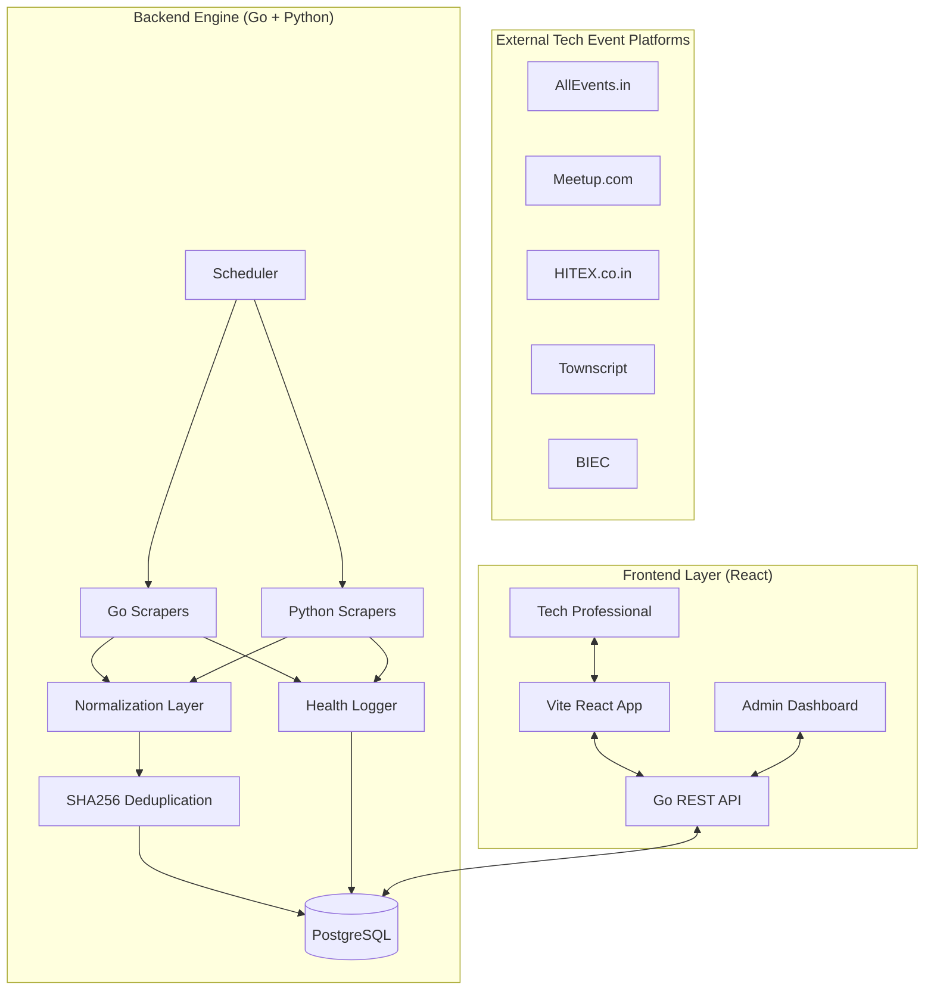

# Architectural Review: Event Scraper (India Tech Events)

## 🏗️ System Overview

The Event Scraper is a robust, multi-tier application designed to aggregate tech event information from various Indian platforms. It employs a hybrid scraping strategy, leveraging both Go and Python to handle different types of web content, with a PostgreSQL foundation for data durability and a modern React frontend for user discovery.

### 🛠️ Technology Stack

| Layer | Technology |
| :--- | :--- |
| **Frontend** | React, Vite, Tailwind CSS, React Router |
| **Backend (Orchestrator)** | Go (Golang) |
| **Scraping Engine** | Go (`goquery`, `chromedp`) & Python (`BeautifulSoup`, `Selenium`) |
| **Database** | PostgreSQL |
| **Infrastructure** | Docker, Docker Compose |
| **Security** | JWT (JSON Web Tokens) for User Auth, SHA256 Hash-based Deduplication |
| **Monitoring** | Internal Scraper Health Dashboard |

---

## 📐 Architecture Breakdown

### 1. Data Acquisition (Scrapers)
The project uses a sophisticated hybrid approach:
- **Go Scrapers**: Used for high-performance static scraping (`goquery`) and headless browser automation (`chromedp`) for platforms like AllEvents, Meetup, and Townscript.
- **Python Scrapers**: Specifically the `hitex.py` script, providing flexibility for complex sites using `Selenium` and `BeautifulSoup`.
- **Deduplication**: Every event is hashed using SHA256 (Name + Date + Location), ensuring that even if multiple scrapers find the same event, it's stored only once.
- **Detail Scraping**: A standalone process that visits each event's URL to extract full descriptions, organizer info, tags, pricing, and registration links. Uses a multi-layer approach with CSS selectors, meta tags, and Google Search fallback for resilience.

### 2. Backend Orchestration (Go Server)
- **Scheduler**: A cron-based system that manages the execution frequency of all scrapers.
- **REST API**: A clean Go-based API serving the frontend. It handles authentication, event retrieval, filtering, and user-specific "saved events".
- **Database Layer**: Implements efficient batch inserts and connection pooling.
- **Health Monitoring**: Records every scraper run (success/fail, error messages, event counts, durations) into a `scraper_runs` table, exposed via the Health Dashboard API.

### 3. Database Schema
- **events**: Core table for basic event metadata.
- **event_details**: Deeper information (descriptions, organizers, tags) which might be scraped in a secondary "detail" pass.
- **users / saved_events**: Supporting personalization and bookmarking.
- **scraper_runs**: Audit log of every scraper execution for health monitoring.

### 4. User Interface (React)
- **Modern Dashboard**: Clean, responsive layout.
- **Filtering System**: Allows users to narrow down events by date and type.
- **Dynamic Content**: Uses SVGs and placeholders for events without images.
- **Scraper Health Dashboard**: Internal admin view showing which scrapers are running, failing, and why.

---

## 📊 Data Flow Visualization

---

## 🚀 Challenges & Suggested Improvements

### 1. Immediate Challenges
- **Anti-Bot Sophistication**: Sites like Townscript or AllEvents often update their DOM or add anti-bot measures (Cloudflare, CAPTCHA). 
- **Resource Intensity**: Running multiple headless browsers (`chromedp`/`Selenium`) concurrently is memory-intensive.
- **Data Quality**: Date formats across 7+ platforms vary wildly, leading to potential parsing errors.

### 2. Suggested Improvements
- **Distributed Workers**: As you scale from 7 to 70 sources, consider moving scrapers to separate worker nodes (e.g., via Redis/RabbitMQ queue).
- **Health Dashboard**: ✅ Built — an internal view to see which scrapers are failing and why (e.g., "Selector changed on Meetup.com").

---

> [!TIP]
> Your architecture is already very mature for a self-built project. The transition to Go for the orchestrator was a smart move for performance and concurrency!
